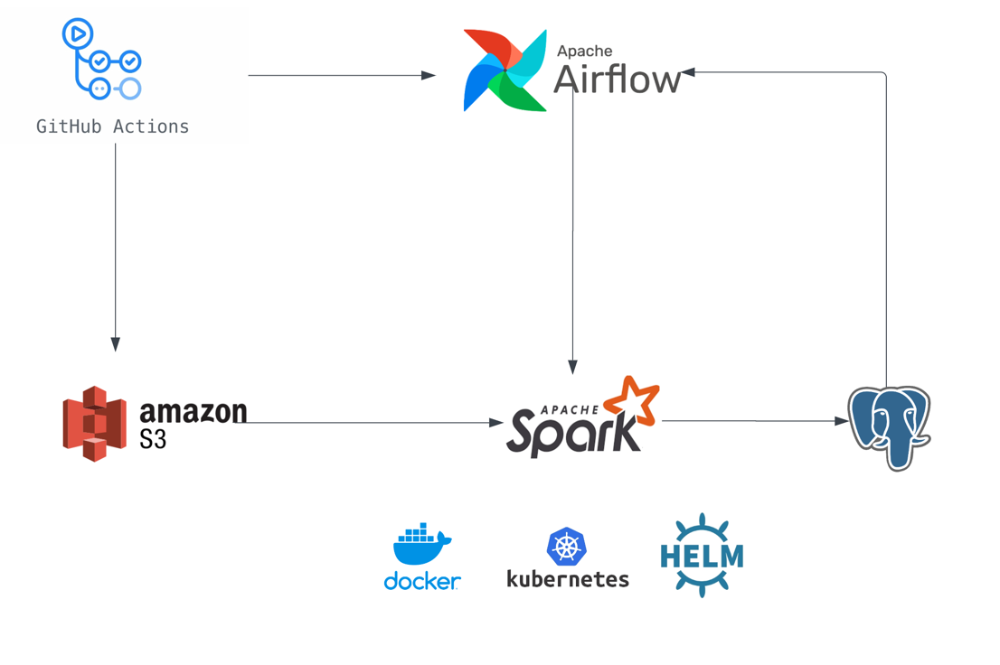

# ETL project





## Description

This project architecture consists of the following components:

* Apache Spark as a data processing engine 
* Apache Airflow as an orchestrator
* Amazon S3 as a raw data storage and dags code repository
* Postgres SQL as a destination storage fro processed data
* Kubernetes as an environment to deploy all system components and run Spark jobs
* Helm as a package manager
* GitHub Actions and DockerHub for CI/CD 

This project is built as a template ETL pipeline to reuse it for workflows with similar purposes and architecture.
It also can be used as a reference for ones who want to explore Big Data processing and Data Engineering technologies.

## Setup

### Construct base image with all the dependencies
```
# Use an official Spark image as the base image
FROM apache/spark:3.4.0

# Set the working directory in the container
WORKDIR /opt/spark

# Copy necessary jars to root directory
# aws-java-sdk-bundle-1.12.262.jar
# hadoop-aws-3.3.4.jar                    
# postgresql-42.5.1.jar                   
# snappy-java-1.1.8.4.jar

COPY ./jars ./jars

# Remove buggy snappy jar
RUN rm /opt/spark/jars/snappy-java-1.1.9.1.jar

# Optionally, you can install any additional dependencies using pip
RUN pip install -r ./dags/requirements.txt
```

## Deployment

After all docker images, dags code are in place you can run the following command to deploy the helm chart to desired K8s namespace 

```
cd deployment
./deploy.sh <namespace>
```